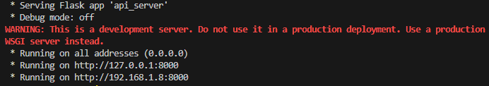
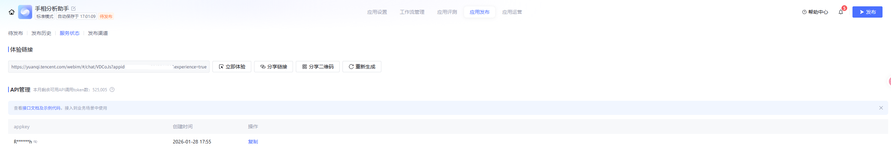

## 安装与运行

### 1) 环境准备
- Python（建议 3.x）
- 如需 GPU，请先根据你的 CUDA 环境安装对应版本的 `torch/torchvision`

### 2) 安装依赖
在项目根目录执行：
```bash
python -m venv .venv
# Windows
.venv\Scripts\activate
# macOS / Linux
source .venv/bin/activate

pip install -r code/requirements.txt
```

如果提示有部分依赖未安装，可以根据控制台输出的提示自行安装。

### 3) 启动后端服务（识别接口）

模型文件默认读取 `code/checkpoint/checkpoint_aug_epoch70.pth`，请确认该文件存在。
```bash
python code/api_server.py
```
默认监听：`http://127.0.0.1:8000`
接口：`/api/predict`、`/api/palm/analysis`

启动成功：


### 4) 启动 H5 前端演示
```bash
cd mobile/h5
python -m http.server 8001
```
浏览器访问：`http://127.0.0.1:8001`

如需修改后端地址，可在 `mobile/h5/index.html` 中调整：
```html
<script>
  window.PALMTRACE_API_URL = "http://127.0.0.1:8000/api/predict";
  window.PALMTRACE_ANALYSIS_URL = "http://127.0.0.1:8000/api/palm/analysis";
</script>
```

建议安装插件：open in brower，即可右键快速启动。


启动成功：


### 5) 命令行单张图片测试（可选）

将图片放入 `code/input/`，然后执行：
```bash
python code/read_palm.py --input your_image.jpg
```
输出结果在 `code/results/`。


## 演示步骤

1) 启动后端服务（见上方“安装与运行”第 3 步）。
2) 启动 H5 前端并打开页面（见上方“安装与运行”第 4 步）。
3) 点击“导入照片”或“拍照”，上传手掌图片；模型会自动识别并绘制三大主线。
4) 如需手动校正，打开“手动校正”开关，使用拖动/添加/删除等工具调整线条。
5) 点击“导出 JSON”，保存当前识别（包含手动修正）的结果。

可选：启用“手相解读”功能（需腾讯元器）
- 访问 https://yuanqi.tencent.com/，新建智能体并导入 `docs/workflows/export-分析助手-高优先级.zip`。
- 发布成功后，在项目根目录的 `.env` 配置以下字段：
```env
PALM_ASSISTANT_API_KEY=your_appkey
PALM_ASSISTANT_ID=your_appid
PALM_ASSISTANT_ENDPOINT=https://yuanqi.tencent.com/openapi/v1/agent/chat/completions
```
- `your_appkey` 与 `your_appid` 可在“应用发布” -> “服务状态”中查看。

