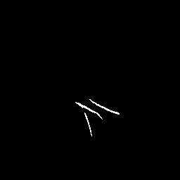
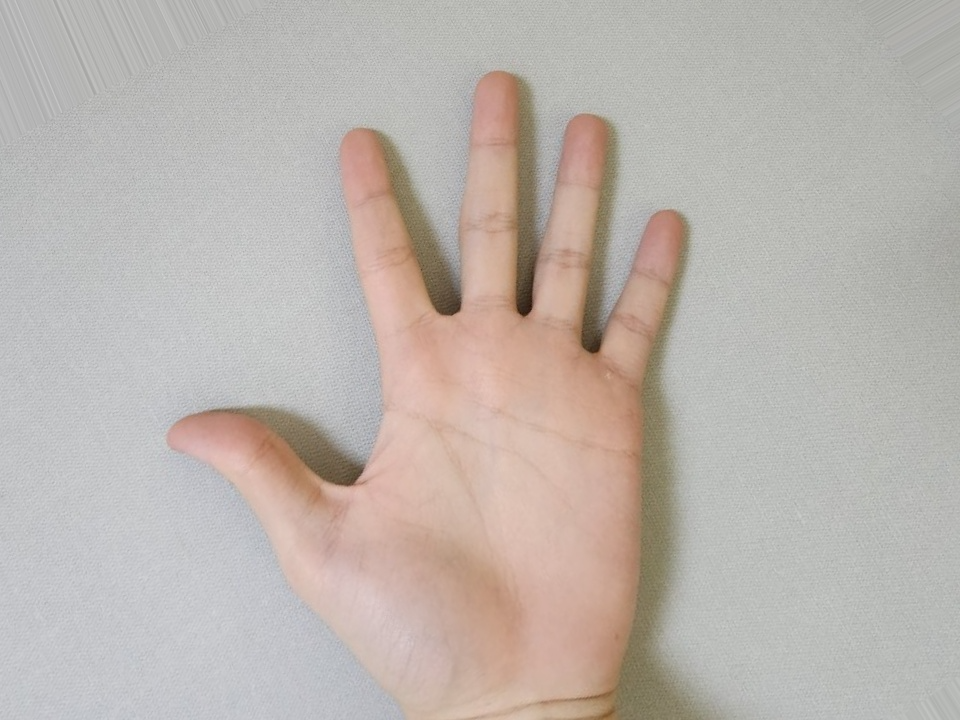
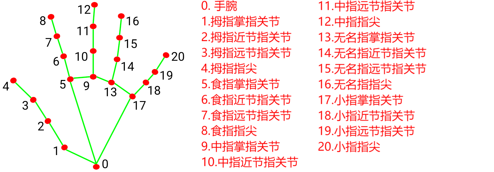

# 算法/模型如何从掌纹中区分三条主线

本文档结合当前项目实现（`code/read_palm.py` / `code/classification.py` / `code/detection.py` / `code/rectification.py`）说明三条主线（心线/智慧线/生命线）从掌纹中区分的具体流程与判定逻辑，并补充工程细节与关键参数，便于复现与调试。

## 1. 总体思路

本项目采用“**掌纹分割 → 骨架化 → 图结构线段提取 → 特征匹配选线**”的流程，不直接做三类分割，而是先提取所有可能线段，再通过特征空间匹配筛出三条主线。

**设计取舍**：
- 三类分割需要大量精细标注数据，现阶段成本高；
- 先提取线段再分类，能在较少标注下获得可用结果；
- 主线是“形态 + 位置”强先验问题，特征匹配可解释性更强。

## 2. 关键步骤

> 本节以 `code/read_palm.py::main` 的流水线为主线，逐步拆解。

### 2.0 输入与预处理

- **输入**：掌心照片，建议手心完整可见，光照均匀。

- **预处理**：`tools.remove_background` 通过 HSV 颜色阈值粗略去背景，降低背景噪声对分割的干扰。

  - HSV 是把颜色拆成 色相(H)、饱和度(S)、明度(V) 三个维度的颜色表示方式。
  - “阈值”就是对 H/S/V 三个通道分别设定上下限，只有落在这个范围内的像素才被认为是“皮肤/掌心区域”，否则被当成背景。
  - 作用：快速粗略地把“可能是皮肤的区域”保留下来，把背景、桌面、衣物等颜色过滤掉，减少后面模型的干扰。

- **输出**：`results/palm_without_background.jpg`

  

### 2.1 掌纹分割（线条检测）

- **输入**：经过校正的掌心图像（`rectification.warp_with_matrix`）。

- **模型**：U-Net（`model.UNet`），输出掌纹区域的二值 mask,`results/palm_lines.png`。

  -  **把手掌图缩小、规范化**：先把图片缩到固定大小（256×256），并把像素值压到 0~1，方便网络处理。

  - **通过监督学习，哪些像素像“掌纹线条”，哪些像素像“背景”**：靠大量“图片 + 对应线条标注”的训练样本，通过误差修正学出来。

  - **输出“概率图”**：每个像素都会得到一个分数（分数高 → 更像掌纹线条；分数低 → 更像背景）

  - **用阈值分割成黑白图**：把分数 > 0.03 的像素当成“线条”[1,1,1]，其它当成“背景”[0,0,0]。

  - **保存为图片**：乘以 255，变成 [255,255,255] 和 [0,0,0]

    

- **实现位置**：

  - 推理入口：`code/read_palm.py` 中 `detect(...)` 的调用；
  - 推理函数：`code/detection.py` 中 `detect(net, jpeg_dir, output_dir, resize_value, device=...)`。

- **关键设定**：输入统一到 `256x256`，阈值 `0.03` 将模型输出转为二值线条。

**核心代码片段**：

```python
# code/detection.py

def detect(net, jpeg_dir, output_dir, resize_value, device=torch.device('cpu')):
    pil_img = Image.open(jpeg_dir)  # 读取输入图像（掌心图）
    img = np.asarray(pil_img.resize((resize_value, resize_value), resample=Image.NEAREST)) / 255  # 缩放并归一化到 [0,1]
    img = torch.tensor(img, dtype=torch.float32).unsqueeze(0).permute(0,3,1,2).to(device)  # 转为张量并调整为 NCHW
    pred = net(img).squeeze(0)  # 前向推理得到概率图（去掉 batch 维）
    pred = torch.Tensor(  # 阈值化为二值线条图（3 通道）
        np.apply_along_axis(lambda x: [1,1,1] if x > 0.03 else [0,0,0], 0, pred.cpu().detach())
    )
    Image.fromarray((pred.permute((1,2,0)).numpy() * 255).astype(np.uint8)).save(output_dir)  # 保存线条图
```

**说明**：

- `Image.NEAREST` 保留线条的细节边缘，避免插值导致的模糊；
- `pred` 是模型的概率输出，使用固定阈值转成二值掩码；
- 输出是 3 通道的“线条图”，后续用于 2.3骨架化（细线化）。

### 2.2 图像校正（掌心对齐）

> 该步骤发生在分割之前，单列出来便于理解“线条在统一坐标系中比较”的原因。

- **输入**：原始掌心图像路径 `input/xxx.jpg`，以及输出路径 `path_to_warped_image`。

- **输出**：透视校正后的图像 `results/warped_palm.jpg`，以及单应矩阵 `M` 与图像尺寸。

  

  其中，单应矩阵是一个 **3×3 的透视变换矩阵**：前两行决定“平面内的旋转、缩放、平移、剪切”，第三行决定“透视扭曲”。

- **目的**：将不同人的手掌对齐到统一模板坐标，减少姿态差异带来的位置漂移。

- **实现位置**：`code/rectification.py::warp_with_matrix`

- **做法**：
  - MediaPipe Hands 检测 21 个手部关键点；
  
    
  
  - 使用固定的目标模板 `pts_target_normalized`；
  
  - 通过 `cv2.findHomography` 求单应矩阵；
  
  - `cv2.warpPerspective` 完成透视变换。
  
- **失败条件**：
  - 未检测到手部；
  - 关键点靠近图像边缘（`EDGE_MARGIN`），认为手掌不完整。但是后续有“回退”流程，**不做透视校正**，直接用原图继续走后面的识别流程，缺点是会消耗更多的时间。

### 2.3 骨架化（细线化）

- **输入**：分割输出的二值线条图（`results/palm_lines.png`，**RGB 三通道图像** ，每个像素的取值只有两种可能：背景像素：[0, 0, 0]（黑）；线条像素：[255, 255, 255]（白））。

- 具体做法：对分割后的掌纹 mask 进行骨架化，得到单像素宽的掌纹骨架。

  其中，**细线化/骨架化**操作：

  - 把一条“粗线条”压缩成**单像素宽的中心线**，
  - 保留线条的整体形状和连通关系，
  - 去掉多余的厚度。

- 目的：将粗线条转为连通曲线，便于后续图结构建模。

- **输出**：单像素宽的骨架图（灰度图，非零像素表示掌纹骨架），使用变量`skel_img`存储。

- **实现位置**：`code/classification.py` 中 `classify` 里对分割图直接骨架化。

**核心代码片段：

```python
# code/classification.py

palmline_img = cv2.imread(path_to_palmline_image)  # 读取分割后的线条图
# kernel = np.ones((3, 3), np.uint8)  # 形态学核（可选）
# dilated = cv2.dilate(palmline_img, kernel, iterations=3)  # 可选：膨胀
# eroded = cv2.erode(dilated, kernel, iterations=3)  # 可选：腐蚀
skel_img = cv2.cvtColor(skeletonize(palmline_img), cv2.COLOR_BGR2GRAY)  # 骨架化并转为灰度
```

**说明**：
- 这里直接对分割结果做 `skeletonize`，获得单像素宽骨架；

- 形态学操作保留为可选项（注释掉的膨胀/腐蚀）。

  其中，

  - **形态学核**是在图像上滑动时用它来判断和修改周围像素。
  - **膨胀**会让线条变粗、孔洞变小、断裂处更容易连上。
  - **腐蚀**会让线条变细、去掉噪点，但也可能让细线断开。


### 2.4 图结构线段提取

- **输入**：骨架化后的灰度骨架图（`skel_img`，非零像素表示线条）。

- 将骨架图视为图结构：
  - **节点**：端点（度=1）与交叉点（度≥3）。
  
    
  
  - **边**：节点之间的连续像素序列。
  
- 通过图回溯枚举所有可能的线段路径。

- 过滤过短或方向异常的线段：

  - 像素数量 < 10
  - 方向反转：v1 · v2 < 0（点积为负）→ 说明方向夹角 > 90°，线段在“折回/反向”，被认为异常

- **输出**：候选线段列表 `lines`（每条线为像素序列，含方向信息）。

- **实现位置**：`code/classification.py` 中 `group` / `backtrack`。

**核心代码片段**：

```python
# code/classification.py (节选)

def group(img):
    count = np.zeros(img.shape)  # 记录每个像素的邻域连接数
    nodes = []  # 存储端点/交叉点

    for j in range(1, img.shape[0] - 1):  # 遍历行（避开边界）
        for i in range(1, img.shape[1] - 1):  # 遍历列（避开边界）
            if img[j, i] == 0:  # 非骨架像素跳过
                continue
            count[j, i] = np.count_nonzero(img[j-1:j+2, i-1:i+2]) - 1  # 统计 3x3 邻域连通数
            if count[j, i] == 1 or count[j, i] >= 3:  # 端点或交叉点
                nodes.append((j, i))  # 收集为图节点

    # 构图并回溯，得到所有候选线段
    lines_node = []  # 存储回溯得到的节点路径
    visited_node, finished_node = {}, {}  # 记录访问状态
    for node in nodes:  # 初始化访问标记
        visited_node[node] = False
        finished_node[node] = False
    for node in nodes:  # 逐节点回溯枚举路径
        if not finished_node[node]:
            temp = [node]  # 当前路径
            visited_node[node] = True  # 标记已访问
            finished_node[node] = True  # 标记已完成
            backtrack(lines_node, temp, graph, visited_node, finished_node, node)  # 回溯扩展路径
```

**说明**：
- 端点与交叉点由 3x3 邻域像素计数得到；
- 图回溯产生的线段再根据长度与方向一致性做过滤。

### 2.5 三条主线选择（特征匹配）

- 对每条候选线段提取特征：
  - 线段的最小/最大边界（min/max x,y），在图像坐标系里，原点在左上角：
  
    - **min_y**：这条线段所有点里，y 最小的那个（最靠上）
    - **max_y**：这条线段所有点里，y 最大的那个（最靠下）
    - **min_x**：这条线段所有点里，x 最小的那个（最靠左）
    - **max_x**：这条线段所有点里，x 最大的那个（最靠右）
  
  - 线段方向的分段均值（10 个区间）：不是只看整条线的整体方向，而是看它在不同位置的走向变化（是否弯曲、是否在某一段转向）。
  
  - 拼接成固定长度的向量（24 维）。
  
    - **位置特征 4 维**：
      - min_y, min_x, max_y, max_x（归一化后）
    - **方向特征 20 维**：
      - 把线段分成 10 段
      - 每段取方向均值 (dy, dx) → 2 维
      - 10 段 × 2 维 = 20 维
  
    合起来：**4 + 20 = 24 维**
  
- 与预训练的 3 个 K-means 聚类中心做 L2 距离匹配：
  - 每个中心对应一条“典型主线形态”。
  
    - 从 PLSU 数据集加载并校正样本
    - 对样本骨架化、提取候选线段
    - 对每条线段计算 24 维特征
    - 用 cv2.kmeans(..., k=3) 做聚类
    - 得到 3 个中心，并按 max_y 排序
  
  - 选择距离最近的 3 条候选线段作为主线输出。
  
    最终输出结构是：
  
    ```python
    [  
     [[y,x,dy,dx], [y,x,dy,dx], ...],   # 心线候选  
     [[y,x,dy,dx], [y,x,dy,dx], ...],   # 智慧线候选  
     [[y,x,dy,dx], [y,x,dy,dx], ...]    # 生命线候选 
    ]
    ```
  
  这里的 dy, dx 是这条线段在当前像素处的方向向量，表示从前一个点走到下一个点的“位移方向”。
  
- **实现位置**：`code/classification.py` 中 `extract_feature` / `classify_lines` / `get_cluster_centers`。

**核心代码片段**：

```python
# code/classification.py (节选)

def extract_feature(line, image_height, image_width):
    image_size = np.array([image_height, image_width], dtype=np.float32)  # 图像尺寸
    feature = np.append(  # 位置特征：min/max 归一化
        np.min(line, axis=0)[:2] / image_size,
        np.max(line, axis=0)[:2] / image_size,
    )
    feature *= 10  # 放大位置特征权重
    N = 10  # 分段数量
    step = len(line) // N  # 每段长度
    for i in range(N):  # 逐段统计方向均值
        l = line[i*step:(i+1)*step]
        feature = np.append(feature, np.mean(l, axis=0)[2:])
    return feature  # 返回 24 维特征


def classify_lines(centers, lines, image_height, image_width):
    classified_lines = [None, None, None]  # 三条主线结果
    line_idx = [None, None, None]  # 记录已选择的线索引
    nearest = [1e9, 1e9, 1e9]  # 每个中心的最小距离

    feature_list = np.empty((0,24))  # 收集所有线段特征
    for line in lines:  # 提取每条线段的特征
        feature = extract_feature(line, image_height, image_width)
        feature_list = np.vstack((feature_list, feature))

    for i in range(3):  # 依次为三个中心挑选最近的线
        center = centers[i]
        for j in range(len(lines)):
            if j in line_idx[:i]:  # 避免重复选线
                continue
            dist = np.linalg.norm(feature_list[j] - center)  # L2 距离
            if dist < nearest[i]:
                nearest[i] = dist
                classified_lines[i] = lines[j]
                line_idx[i] = j
    return classified_lines  # 返回三条主线
```

**说明**：
- 线段位置（min/max）编码了“位于掌心上/中/下”的信息；
- 方向均值编码了“走向、弯曲程度”的信息；
- K-means 中心在 `get_cluster_centers` 中给出（当前项目使用固定中心）。

### 2.5.1 重叠惩罚（避免三条线“粘在一起”）

为避免三条线选到同一条或高度重叠的线段，`select_lines_with_overlap_penalty` 增加了重叠惩罚：

- 先取每个中心最近的 `top_k` 候选；
- 枚举 3 线组合，计算三两之间的重叠比例；
- 若平均重叠超过阈值（默认 `0.35`），加惩罚分；
- 选择综合得分最低的组合。

这一步能显著减少“主线重复”的情况，但可能导致置信度略下降。

## 3. 三条主线的判定依据

该项目的“心线/智慧线/生命线”并非通过语义标签直接预测，而是通过**形态位置分布 + 方向特征**间接区分：

- **心线（Heart line）**：
  - 通常位于掌心上部（靠近指根），走向较水平。
- **智慧线（Head line）**：
  - 位于掌心中部，走向横向或微向下倾斜。
- **生命线（Life line）**：
  - 位于掌心下部，通常为弧形围绕大拇指根部。

在实现中，三条线的形态与位置被编码进聚类中心，最终通过“特征相似度”完成区分。

**从工程角度理解**：
- “心线”更靠上，且方向较水平；
- “智慧线”更居中，方向偏斜；
- “生命线”更靠下且弯曲；
- 这些先验被固化在聚类中心中。

## 4. 与直接分类的差异

- **当前方案**：先找所有线段，再匹配出三条主线（特征聚类）。
- **直接方案**：在分割阶段直接输出三类（心线/智慧线/生命线）。
- **原因**：
  - 多类分割需要大量精细标注数据；
  - 当前数据与时间成本更适合“后处理分类”的策略。
