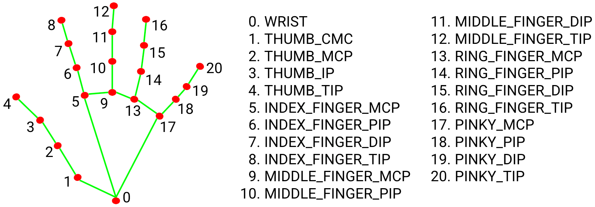

# 技术选型与调查报告

本文档基于当前项目实现（`code/read_palm.py` 与 `code/api_server.py`）总结技术选型原因、可替代方案与失败场景，面向“掌纹三大主线识别与绘制”的交付要求。

## 1. 系统方案概述（现有实现）

1. **输入与预处理**  
   - 读取图片（JPG/PNG），EXIF 方向纠正，必要时边缘留白。  
   - HSV 颜色阈值做简易手部背景抠取（`tools.remove_background`）。
   
2. **掌心校正（视角归一）**  
   - MediaPipe Hands 提取 **21 个关键点**。  
   
    
   
   - 基于同一套“目标关键点”做单应性（Homography）对齐（`rectification.warp_with_matrix`）。
   
3. **掌纹检测（线条分割）**  
   - 使用 U-Net 进行掌纹区域分割（`model.UNet` + `detection.detect`）。  
   
     
   
4. **三大主线识别**  
   - 对分割结果 skeletonize，构图后回溯得到候选线段。  
   - 用预训练 K-means 中心在特征空间选出三条线（`classification.classify`）。
   
5. **结果回映与展示**  
   - 将检测线反投影到原图并绘制（`read_palm.draw_lines_on_original`）。  
   - 输出 JSON（关键点、置信度、线段点集）与可视化图。

## 2. 技术选型与原因

### 2.1 语言与框架

- **Python**：与深度学习、图像处理生态兼容性最好，原型开发效率高，易于实验与迭代。
- **PyTorch**：U-Net 训练/推理常用框架，社区成熟，便于后续迁移至 ONNX/TensorRT。
- **Flask（API）**：轻量、易部署，满足当前单实例推理服务需求（`code/api_server.py`）。

### 2.2 手部关键点与校正

- **MediaPipe Hands**  
  - **为什么选择**：无需自训练，速度快，鲁棒性好，稳定提供 21 个关键点。  
  - **用途**：  
    - 判断手是否完整进入画面；  
    - 计算 Homography 做视角归一；  
    - 输出语义关键点（掌根/虎口/掌心）。

- **OpenCV Homography**  
  - **为什么选择**：对仿射/透视变换有成熟实现，适合将倾斜手掌归一到“标准姿态”。  

### 2.3 掌纹检测（分割）

- **U-Net**  
  - **为什么选择**：对细线条结构提取能力好，适合边缘/纹理类任务。  
  - **当前做法**：固定输入 `256x256`，二值化阈值 `0.03` 生成掌纹 mask。

### 2.4 三大主线分类

- **Skeletonize + 图搜索 + K-means**  
  - **为什么选择**：  
    - 线条结构适合用骨架化获得单像素线；  
    - 用图搜索可得到完整曲线；  
    - K-means 聚类用作“主线形状模板”匹配，免去复杂的多类分割标注成本。

### 2.5 结果回映与可视化

- **PIL / ImageDraw**  
  - 绘线与关键点标注简单直接，与 API 输出结合方便。  

## 3. 可替代方案调研

### 3.1 手部检测与校正

- **替代方案 A：目标检测（YOLO/SSD）+ 手部分割**  
  - 优点：对极端姿态或局部遮挡更鲁棒。  
  - 缺点：需要标注数据，部署复杂度更高。

- **替代方案 B：直接做手掌分割（U^2-Net / MODNet / SegFormer）**  
  - 优点：背景鲁棒性更高，避免 HSV 对不同肤色/光照敏感。  
  - 缺点：模型体积与推理成本更高，需额外数据训练。

### 3.2 掌纹检测

- **替代方案 A：传统图像处理（Gabor/Canny/Frangi + 形态学）**  
  - 优点：轻量、无需训练。  
  - 缺点：对噪声/光照变化敏感，泛化弱。

- **替代方案 B：多类分割（3 类主线）**  
  - 优点：直接得到三条主线，减少后处理。  
  - 缺点：标注成本高，训练数据稀缺。

### 3.3 主线分类

- **替代方案 A：曲线关键点回归（Spline/Bezier 回归）**  
  - 优点：可直接输出平滑曲线。  
  - 缺点：训练复杂、对数据依赖大。

- **替代方案 B：图匹配/最短路径算法（Graph Matching / Dynamic Programming）**  
  - 优点：可基于拓扑结构定位三条主线。  
  - 缺点：实现复杂，计算开销高。

### 3.4 服务化

- **替代方案 A：FastAPI + Uvicorn**  
  - 优点：性能好，异步支持，易生成 API 文档。  
  - 缺点：对本项目并非刚需，增加依赖复杂度。

- **替代方案 B：移动端端侧推理（TFLite/MediaPipe Graph）**  
  - 优点：离线隐私保护、低延迟。  
  - 缺点：模型量化/裁剪成本高，端侧性能限制明显。

## 4. 失败场景与风险

### 4.1 关键点/校正失败

- 手部未完整入镜（手指或掌根被裁切）。  
- 透视角度过大或手部旋转极端，导致 Homography 不稳定。  
- MediaPipe 关键点检测失败（光照不足、遮挡、背景干扰）。

### 4.2 掌纹检测失败

- 低分辨率、模糊、过曝或强阴影。  
- 背景抠取失败（HSV 阈值对肤色/光照敏感）。  
- 手掌过于干燥、纹理不明显或被反光覆盖。

### 4.3 主线分类失败

- 骨架断裂导致图结构不完整，回溯得到短线或错误线。  
- K-means 中心与实际样本分布偏移（数据域变化）。  
- 多条相近纹理重叠，导致“错分主线”。

### 4.4 体验与性能风险

- 在低端设备上推理耗时超出 2 秒要求。  
- 多手同时出现在画面时，当前实现只处理单手。  
- 左右手姿态差异可能影响分类稳定性。

## 5. 选型结论

当前方案以“**MediaPipe + Homography + U-Net + 图结构分类**”为主干，兼顾了实现复杂度与可用性，适合快速交付 Demo 与实验验证。后续若要提升鲁棒性，优先升级方向建议为：

1. 更稳健的手掌/背景分割（替代 HSV 阈值）；  
2. 多类分割模型直接预测三条主线；  
3. 使用更大规模的掌纹标注数据微调模型。
